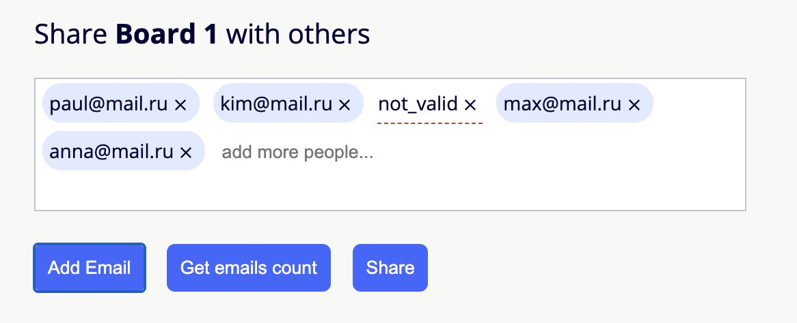

# emails-input

Share with friends component 🤘



[Demo](https://pabloasc.github.io/emails-input/)

## Usage

Include the library in your code and initialize with your desired html element where you want to render the component and the additional settings.

 ```
 <html>
    <head>
        <link rel="stylesheet" href="lib/assets/style.css">
        <script src="lib/emails-input.js"></script>
    </head>
    <body>
        <div id="emails-input"></div>
        <script>
            /* your callback function to send the emails */
            const shareBoard = function(emails) {
                for (var i = 0; i < emails.length; i++) {
                    alert('Sharing board to: ' + emails[i]);
                }
            }
            var inputContainerNode = document.querySelector('#emails-input');
            var emailsInput = EmailsInput(inputContainerNode, { addRandomEmail: true, getEmailCount: true, shareButton: shareBoard });
        </script>
    </body>
</html>
```

## Settings

* **addRandomEmail** (bool): Adds a button to include a random email address.
* **getEmailCount** (bool): Adds a button to get the amount of valid email addresses.
* **shareButton** (function): Adds the 'Share' button that triggers the callback function with an array of valid emails.


## Run tests

install dependencies (**/lib** folder)

```
yarn
```

**Run unit tests**

```
yarn test
```

**Snapshot tests**

Snapshot tests are a very useful tool whenever you want to make sure your UI does not change unexpectedly.

When you add a change that changes the UI, you can regenerate snapshots:

```
yarn jest --updateSnapshot
```

## Author

Pablo Villalon